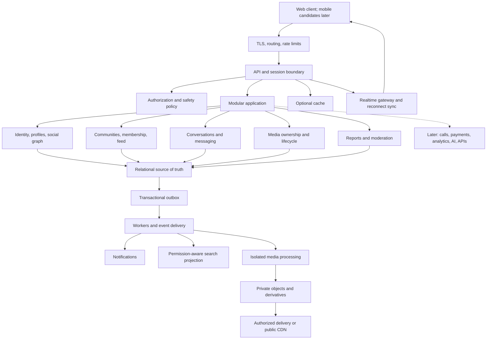
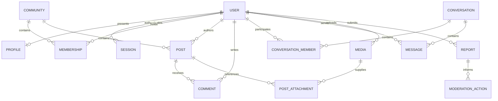
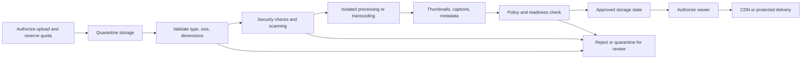
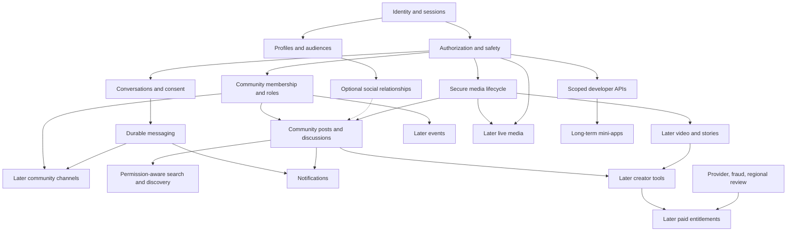

# LevoVerse

**One identity. One network. Every way to connect.**

A proposed unified digital social ecosystem connecting relationships, conversations, communities, and content through shared foundations.

**Status: Concept / Planning / Architecture Stage**  
**Development model: Public planning; implementation has not begun**  
**License: To be determined**  
**Founder/project lead: Alban — aka Altechie / Just Levo**

LevoVerse is a product vision and planning effort, not an available application. This README is its initial master blueprint: a common reference for founders, engineers, designers, product managers, safety teams, contributors, partners, and potential stakeholders. It describes what could be built, why it might matter, and what evidence is needed before committing resources.

There are no releases, deployed services, security certifications, funded commitments, or implementation results claimed here. No technology stack, launch date, operating jurisdiction, business model, or open-source license has been approved.

## 1. Project header and how to read this blueprint

**Positioning:** LevoVerse proposes a consistent way to move between sharing, belonging, and conversation without repeatedly rebuilding identity and relationships. Its value must come from useful connections between experiences, not the number of features it contains.

### Decision labels

| Label | Meaning in this document |
| --- | --- |
| **Confirmed vision** | Direction explicitly established by the founder: a unified ecosystem, shared identity and network, planning before implementation. |
| **Proposal** | A reasoned recommendation for discussion; not an approved product or technical commitment. |
| **Assumption** | A working premise that must be tested. |
| **Open question** | A decision requiring evidence, founder approval, specialist review, or some combination. |
| **Future possibility** | An option for later evaluation; inclusion does not promise delivery. |

### Delivery horizons

| Horizon | Meaning |
| --- | --- |
| **MVP — Must Have** | Proposed minimum scope for a useful, safely operated pilot, subject to discovery and release gates. |
| **MVP — Should Have** | Useful enhancements only if they do not delay or weaken the core pilot. |
| **Later** | Consider after the core experience demonstrates value and operational readiness. |
| **Long-Term** | Strategic options requiring a much more mature platform, business, or ecosystem. |

Every unimplemented capability below is a **proposal or future possibility**, including statements using “should” or “must.” These words express intended acceptance requirements, not existing guarantees. Section 43 is the authoritative proposed MVP scope; the capability map is not a promise to build everything. If future sections conflict, resolve the inconsistency through a reviewed decision rather than silently expanding scope.

**Reading paths:** Start with sections 2–6 and 43–45 for product direction; 27–42 for trust and architecture; 46–52 for delivery and governance; 50 for unresolved decisions. Sources are linked where they inform technical claims and collected at the end. Research is a starting point, not certification or legal advice.

### Table of contents

<!-- TOC -->
#### Project foundations

- [1. Project header and how to read this blueprint](#1-project-header-and-how-to-read-this-blueprint)
- [2. Vision](#2-vision)
- [3. Problem statement](#3-problem-statement)
- [4. Proposed solution](#4-proposed-solution)
- [5. Core product principles](#5-core-product-principles)
- [6. User types](#6-user-types)

#### Product capability map

- [7. Identity and accounts](#7-identity-and-accounts)
- [8. Social graph](#8-social-graph)
- [9. Messaging](#9-messaging)
- [10. Communities](#10-communities)
- [11. Social feed](#11-social-feed)
- [12. Stories and temporary content](#12-stories-and-temporary-content)
- [13. Short-form video](#13-short-form-video)
- [14. Long-form video](#14-long-form-video)
- [15. Livestreaming](#15-livestreaming)
- [16. Voice and video communication](#16-voice-and-video-communication)
- [17. Professional layer](#17-professional-layer)
- [18. Creator ecosystem](#18-creator-ecosystem)
- [19. Search and discovery](#19-search-and-discovery)
- [20. Notifications](#20-notifications)
- [21. Files and media](#21-files-and-media)
- [22. Events](#22-events)
- [23. Payments and monetization](#23-payments-and-monetization)
- [24. AI layer](#24-ai-layer)
- [25. Developer platform](#25-developer-platform)
- [26. Mini-app ecosystem](#26-mini-app-ecosystem)

#### Trust, privacy, and safety

- [27. Privacy](#27-privacy)
- [28. Security](#28-security)
- [29. Trust and safety](#29-trust-and-safety)
- [30. Child and teen safety](#30-child-and-teen-safety)

#### Technical blueprint

- [31. High-level architecture](#31-high-level-architecture)
- [32. Monolith, modular monolith, or microservices](#32-monolith-modular-monolith-or-microservices)
- [33. Candidate technology stack](#33-candidate-technology-stack)
- [34. Conceptual data model](#34-conceptual-data-model)
- [35. API strategy](#35-api-strategy)
- [36. Realtime architecture](#36-realtime-architecture)
- [37. Media pipeline](#37-media-pipeline)
- [38. Recommendation systems](#38-recommendation-systems)
- [39. Scalability](#39-scalability)
- [40. Reliability and observability](#40-reliability-and-observability)
- [41. Accessibility](#41-accessibility)
- [42. Internationalization](#42-internationalization)

#### Product development strategy

- [43. MVP definition](#43-mvp-definition)
- [44. Development phases](#44-development-phases)
- [45. Feature dependency map](#45-feature-dependency-map)
- [46. Repository strategy](#46-repository-strategy)
- [47. Development workflow](#47-development-workflow)
- [48. Testing strategy](#48-testing-strategy)
- [49. Documentation strategy](#49-documentation-strategy)
- [50. Open questions and decision register](#50-open-questions-and-decision-register)
- [51. Risks](#51-risks)
- [52. Success metrics](#52-success-metrics)
- [53. Business model possibilities](#53-business-model-possibilities)
- [54. Competitive landscape](#54-competitive-landscape)
- [55. What LevoVerse is not](#55-what-levoverse-is-not)

#### Reference and project information

- [56. Glossary](#56-glossary)
- [57. FAQ](#57-faq)
- [58. Project status](#58-project-status)
- [59. Founder](#59-founder)
- [60. License](#60-license)
- [Research references and maintenance](#research-references-and-maintenance)
<!-- /TOC -->

## 2. Vision

**Confirmed vision.** LevoVerse aims to make identity, relationships, communication, and content work together across many modes of connection. Someone might discover an artist, join a discussion about their work, exchange a private message, and later attend a live session without maintaining separate accounts and reconstructing the same network each time.

“One identity” means a coherent account foundation, not compulsory real names or one public persona for every context. A person may need different boundaries for friends, a public audience, and professional life. Multiple personas are a future possibility; even a single-profile MVP should avoid assuming that all profile fields, relationships, or activities are public.

“One network” means relationships can carry useful context across modules. It does not mean a follow grants messaging access, a community membership grants access to private files, or a paid subscription grants personal contact rights. Each interaction needs an explicit permission rule.

“Every way to connect” expresses the long-term direction. Progressive disclosure should let someone use a simple community or messaging experience without adopting video, professional networking, monetization, or AI. The interface should make the next relevant action easier while keeping unrelated features out of the way.

**Assumption to test:** People in a clearly defined initial community will value continuity between updates, discussion, and private conversation enough to return. This is more testable than a claim that everyone wants a universal platform.

## 3. Problem statement

People often maintain separate identities and networks for messaging, social updates, short and long video, communities, professional relationships, livestreams, calls, creator support, forums, file sharing, and events. Specialization has real benefits: a focused product can serve a particular need exceptionally well. The opportunity is in the friction between those experiences.

| Fragmentation | User cost | Question LevoVerse should investigate |
| --- | --- | --- |
| Separate profiles and contact lists | Repeated setup, inconsistent identity, rediscovery | Which profile context should carry across experiences, and which should stay separate? |
| Discussion scattered across feeds, chats, and forums | Lost context and duplicate explanations | Can a shared reference preserve context without copying private material? |
| Community activity split across tools | Organizers repeat announcements, invitations, and moderation | Does a small integrated community reduce work for members and moderators? |
| Different privacy and notification settings | Hard-to-predict audiences and repeated interruptions | Can consistent controls improve confidence and reduce fatigue? |
| Creator publishing and audience relationships separated | Repeated uploads and disconnected feedback | Which shared tools save meaningful time before monetization is introduced? |
| Files and events detached from conversations | Broken links, unclear access, missed updates | Can permission-aware references keep resources understandable and reachable? |

Integration introduces costs of its own: a larger breach impact, more complex moderation, a confusing interface, and possible dependence on a single provider. LevoVerse must show that continuity and control outweigh these costs for a specific audience. Existing services are not presumed deficient or obsolete.

## 4. Proposed solution

**Proposal.** Build interoperable product modules on a small set of common foundations. Sharing infrastructure should not erase the distinct interaction patterns of a conversation, a community discussion, a video library, or a meeting.

| Shared foundation | Intended responsibility | Boundary to preserve |
| --- | --- | --- |
| Identity and authentication | Stable account identifiers, credentials, sessions, recovery | Public profiles separated from credentials and recovery data |
| Profiles and social graph | Context, relationships, membership references | Following, friendship, membership, and entitlement remain distinct |
| Communication | Conversation membership, delivery, references | Private messages do not become feed content implicitly |
| Content and media | Authorship, attachments, processing, lifecycle | Delivery URLs and derived media obey source permissions |
| Search and discovery | Find accessible people, content, and spaces | Existence, counts, snippets, and suggestions must not reveal restricted objects |
| Notifications | Route relevant events according to preferences | No private content in an inappropriate preview or destination |
| Authorization and safety | Policy evaluation, reports, enforcement | Community authority cannot override platform safeguards |
| Payments — Later | Entitlements and provider integration | Financial records isolated from ordinary social data |
| AI — Later | Explicit assistance and evaluated models | No implicit access to private context or authority for consequential actions |
| Developer APIs — Long-Term | Scoped, revocable integrations | An app receives only user- and platform-authorized access |

A shared content link should point to an object and recheck the viewer's current access. It should not copy an unrestricted snapshot into another module. Sharing a private-community post in a DM should show an access-required state to a nonmember without exposing its title or thumbnail.

**Proposed first proof:** A small invited community can share an update, discuss it, view a participant's permitted profile, and begin a consent-based one-to-one conversation using one account. Measure whether that continuity is useful before adding more product surfaces.

## 5. Core product principles

| Principle | Practical design consequence |
| --- | --- |
| User control | Make audience, notification, recommendation, and account controls understandable at the point of action. |
| Privacy by design | Collect less, default to narrow exposure, and account for copies, indexes, caches, analytics, and backups. |
| Security by design | Threat-model flows and verify authorization before enabling sensitive capabilities. |
| Modularity | Give domains explicit responsibilities; avoid tangled code and unnecessary distributed services. |
| Accessibility | Include disabled users in research and test complete journeys. |
| Performance and affordability | Design for constrained devices, costly data, and unreliable connectivity; budget bytes as well as latency. |
| Reliability | Prefer honest pending/error states over false success; make recovery and ownership explicit. |
| Interoperability and portability | Use documented formats and standards; exports should be useful elsewhere. Federation remains open. |
| Creator empowerment | Preserve attribution, clarify audience controls, and explain analytics without promising revenue. |
| Healthy communities | Equip moderators and members before accelerating reach or invitation growth. |
| Transparent moderation | Explain rules, decisions, scope, and appeals while protecting reporters and investigations. |
| Internationalization | Avoid hard-coding language, script direction, names, time zones, and regional assumptions. |
| Extensibility | Introduce scoped extension points after stable product boundaries exist. |
| Responsible AI | Make assistance visible, optional where appropriate, correctable, and accountable to people. |
| Progressive complexity | Keep the default experience small; introduce advanced controls when relevant. |
| Context integrity | Do not collapse private, public, community, and professional contexts for convenience. |
| Evidence before expansion | Require user benefit, safety readiness, and sustainable cost before adding a module. |
| Honest communication | Distinguish aspirations, experiments, implemented behavior, and verified assurances. |

These principles will sometimes conflict. Richer analytics may conflict with minimization; stronger confidentiality may complicate recovery. Record trade-offs, alternatives, and user impact in an Architecture Decision Record (ADR) or product decision before implementation.

## 6. User types

| Potential user | Primary needs | Proposed horizon |
| --- | --- | --- |
| Regular users | Understandable identity, trusted interaction, privacy, manageable notifications | MVP within a selected pilot audience |
| Community members and organizers | Shared context, participation, rules, membership, moderation | MVP with one simple community model |
| Creators | Publishing, attribution, conversation with an audience | Basic participation in MVP; specialized tools Later |
| Artists | Portfolios, rich media, ownership and attribution | Later dedicated workflows |
| Students | Study groups, collaboration, accessible and affordable participation | Discovery candidate; minors' eligibility is not assumed |
| Professionals | Separate professional context, reputation, portfolios, opportunities | Later |
| Businesses | Organizational identity, delegated roles, customer interaction | Later |
| Organizations | Membership governance, accountable administration, records | Later beyond basic community use |
| Developers | Stable APIs, scoped authorization, documentation, test environments | Long-Term external platform |
| Moderators | Reports, context, proportionate actions, appeals, workload controls | MVP operational role |
| Administrators | Restricted operational access, incident response, auditability | MVP operational role |

**Proposed beachhead:** Small, existing interest or learning communities with willing organizers and recurring conversations. This is a recruitment hypothesis, not an established market. Discovery must compare alternatives and confirm geography, age eligibility, devices, connectivity, language, and moderation capacity. The founder is not assumed to represent every persona.

## 7. Identity and accounts

**MVP proposal:** One account and one profile, using an authentication approach selected during foundation work. Stable opaque internal IDs should prevent username changes from breaking ownership or references. Do not require government identity or real names without demonstrated need and specialist review.

| Capability | Proposed behavior and unresolved work | Horizon |
| --- | --- | --- |
| Registration and authentication | Invite-based pilot; verify chosen recovery/contact channel; prevent enumeration and automated signups | Must Have |
| Usernames | Unique handle with reserved-name and impersonation rules; decide normalization, scripts, renames, and reuse | Must Have |
| Display names, avatars, bios | Presentation distinct from identity; length limits, safe rendering, field visibility | Text profile Must Have; avatar Should Have |
| Recovery | Document assurance and lost-factor handling; recovery must not undermine normal authentication | Must Have |
| Sessions/devices | View and revoke sessions, sign out, expire credentials, show security events | Must Have |
| Privacy levels | Explicit field/content audiences; private-account semantics depend on graph decision | Basic controls Must Have; presets Later |
| Verification | Separate contact verification, organization authority, identity verification, and notability | Later |
| Multiple profiles/personas | Contextual identities beneath an account with deliberate linkability and enforcement rules | Later, speculative |
| Data export and account deletion | Authenticated request, progress, exclusions, and backup expiry; protect other people's private data | Must Have; operator-assisted pilot process acceptable |
| Account portability | Useful export first; imports, migration, and relationship transfer need receiving-system support and consent | Later / Long-Term |
| Age-aware experiences | Decide eligibility and assurance before collecting age data or admitting a cohort | Release gate |

A username is not an authorization identifier. Changing it must not transfer history or access through stale caches. Suspension, deletion, and inactivity require different states. Specify what each does to posts, conversations, reports, and organization ownership.

## 8. Social graph

**Open decision:** Follower-based, friend-based, or hybrid relationships. Community and conversation membership remain separate from all three.

| Model | Strength | Cost or ambiguity |
| --- | --- | --- |
| Directed following | Public publishing and asymmetric creator audiences | A follow may be mistaken for messaging or private-activity permission |
| Mutual friendship | Easier consent and private-sharing explanation | Acceptance friction; less natural for public audiences |
| Hybrid | Public audiences and closer relationships | More states, settings, edge cases, and disclosure risks |

**Proposal:** Membership and explicit DM consent may suffice for the community-led pilot. If personal following proves essential, add one model through an ADR; do not build a full hybrid graph preemptively.

The eventual graph could include following/followers, friends, mutual connections, requests, private-account approvals, close friends, and suggested connections. Define relationship visibility independently from existence. Hidden relationships must not leak through suggestions, mutual counts, exports, or search.

**Blocking and muting are MVP requirements.** Muting changes the muter's experience. Blocking restricts defined interactions; specify effects on mentions, requests, reactions, search, historical conversations, and shared communities. A block cannot erase offline copies. In shared spaces, decide how to hide blocked content while preserving moderators' legitimate access and explain this behavior.

Contact discovery, if introduced, needs consent and an anti-enumeration threat model; hashing phone numbers alone is insufficient. Suggestions should avoid exposing sensitive relationships through inference.

## 9. Messaging

**MVP proposal:** Consent-based one-to-one text conversations, delivery state, basic history, blocking, reporting, and own-message removal. Small-group messaging and images are Should Have; rich channels and advanced controls are Later.

| Area | Conceptual behavior | Horizon |
| --- | --- | --- |
| DMs and message requests | Consent before unsolicited conversation; restrict unwanted links and repeated requests | Must Have |
| Delivery and history | Server acceptance distinct from delivery; stable IDs, retry deduplication, reconnect catch-up | Must Have |
| Replies, reactions, mentions | Reference accessible messages; prevent notification spam | Should Have, starting with replies |
| Group chats | Explicit members, roles, leave/remove flows, invitation consent, new-member history rules | Should Have if capacity permits |
| Threads and pinned messages | Preserve context; define who can pin and what removal does | Later |
| Photos, videos, files, voice messages | Conversation access, upload controls, captions/transcripts, retention | Images Should Have; other formats Later |
| Stickers/GIFs | Accessible labels, licensing, third-party request privacy | Later |
| Editing | Edited marker; decide time window, report evidence, and history | Later |
| Deletion | Distinguish hide-for-me, participant removal, report retention, storage erasure | Basic own-message removal Must Have; advanced policies Later |
| Search | Permission-aware server search for readable messages; local search may be needed for E2EE | Later |
| Read receipts, typing, presence | Separate controls and ephemeral events | Later |
| Disappearing messages | Timer semantics, offline behavior, backup limits, screenshot caveats | Later |
| Scheduled messages | Durable scheduling, cancellation, timezones, authorization at send time | Later |

### Encryption is a foundational decision

TLS protects transport; encryption at rest protects stored data under a key-management model. Neither alone makes a conversation end-to-end encrypted. **LevoVerse does not currently provide or guarantee E2EE.** Choose the private-messaging model before storing real pilot conversations and disclose it honestly.

| Candidate | Advantages | Consequences |
| --- | --- | --- |
| Server-readable with strict access controls | Simpler server search, moderation review, recovery, multi-device history | Operators or compromised backends may access plaintext; requires explicit disclosure and strong governance |
| E2EE using established protocols and reviewed implementations | Limits server access to contents under the threat model | Keys, verification, member changes, recovery, attachments, backups, reporting, metadata protection become major work |
| Different modes by conversation type | Public channels and confidential DMs could coexist | Confusing defaults and migration; users may misunderstand protection |

E2EE affects server-side AI summaries, indexing, bots, backups, legal response procedures, and abuse reporting. Recipient-submitted reports may disclose selected content and must explain that boundary. Device revocation does not reclaim decrypted copies. Key loss may mean history loss without a carefully designed recovery mechanism.

The IETF's [Messaging Layer Security specification](https://www.rfc-editor.org/info/rfc9420/) describes group key establishment with forward secrecy and post-compromise security. It is a candidate reference, not a complete messenger or proof of a secure LevoVerse implementation. Obtain specialist review; do not invent cryptography.

## 10. Communities

**MVP proposal:** One community concept: an invite-only group with members, a shared discussion feed, published rules, and owner/moderator/member roles. “Group,” “space,” and “server” are naming candidates, not separate MVP products.

| Capability | Intended scope |
| --- | --- |
| Membership | Invite, accept, leave, remove, suspend, revoke invitations; bound invitation lifetime and reuse |
| Roles/permissions | Explicit basic privileges; custom roles and channel overrides Later |
| Rules/announcements | Visible rules and lightweight announcements; communicate rule changes |
| Public/private communities | Private pilot first; public discovery after visibility and moderation review |
| Channels | Later discussion and announcement subdivisions; membership need not grant every channel |
| Forums/discussions | Persistent topic conversations; simple posts before specialized forum mechanics |
| Voice rooms/events | Later modules with membership, realtime, and additional safety controls |
| Moderation/audit logs | Reports, member actions, reason codes, restricted history, ownership transfer, appeals |
| Discovery | List only intentionally discoverable spaces; secret names and counts are sensitive |

Define removed-member access, notification/media revocation, and appeals. Protect against owner abandonment and compromised moderators. Community staff act within delegated scope; platform operators retain responsibility for platform-wide abuse. Begin with a small tested role matrix rather than infinitely configurable permissions.

## 11. Social feed

**MVP proposal:** Chronological community text posts and comments, with bounded image attachments after upload readiness. Include explicit audience, deletion, reporting, block/mute effects, pagination, and clear empty/error states. A cross-community home feed is Should Have; global recommendations are Later.

| Capability | Design considerations | Horizon |
| --- | --- | --- |
| Text, links, mentions | Safe rendering; mention limits; server-generated previews need SSRF defenses | Text/plain links Must Have; mentions Should Have; previews Later |
| Photos, videos, carousels | Descriptions, ordering, upload state, processing failures, audience inheritance | Images Must Have after media gate; video/carousels Later |
| Comments/replies | Parent removal behavior, context, bounded nesting | Must Have |
| Likes/reactions | Reversible; protect counts/identities; popularity is not quality | Should Have |
| Polls/hashtags | Expiry, vote privacy, abuse, normalization, ambiguity | Later |
| Reposts/shares | Recheck source access and authorship; never silently widen audience | Later |
| Bookmarks/cloud-saved content | Private references; saving does not preserve access to removed content | Should Have |
| Drafts/editing | Private drafts; edit markers; notification/report implications | Basic drafts Should Have; editing Later |
| Scheduling | Revalidate audience, membership, media, account at publication | Later |
| Content warnings | Accessible notice and user choice; distinct from removal | Basic support Should Have; audience policy can make it mandatory |

Chronology is legible but can still favor prolific authors. Recommendations may improve discovery but need evaluation, controls, and safety capacity. A hybrid should distinguish “Following/Joined” from “Discover,” preserve a non-personalized option, and explain suggestions. No ranking algorithm is selected.

## 12. Stories and temporary content

**Later.** Temporary posts could offer audience selection, replies, reactions, viewer controls, archives, and highlights. Introduce them only for a demonstrated need beyond ordinary posts.

Expiration must define when display, media access, active storage, caches, replicas, and backups cease. Temporary content cannot promise recipients cannot save it. An archive deliberately retains a copy and needs an explicit policy; highlights republish persistent content and need a fresh audience choice.

Viewer lists expose relationships and behavior. Decide who sees views, how blocking affects history, and whether receipts can be disabled. Replies obey messaging-request policy. Reports may need restricted evidence retention rather than automatic expiry.

## 13. Short-form video

**Later.** Vertical discovery is a specialized module, not an MVP prerequisite. Gates include sustainable delivery costs, accessible playback, moderation coverage, and rights management.

Uploading/recording need interrupted-transfer recovery, size/duration limits, previews, drafts, and processing status. Editing, captions, music/audio, and remix/response tools should preserve creator attribution and the permissions of source material. An audio library requires rights arrangements; availability cannot be assumed.

Recommendations, hashtags, comments, sharing, and saving reuse visibility and safety policy. Private clips must not enter public candidate pools. Offer autoplay and data controls and a way to leave the discovery loop. Define what happens to remixes when their source is removed or challenged.

Moderation must consider audio, visuals, overlays, captions, and comments. Copyright disputes and evidence handling need an operational process, not just an upload checkbox. This module's value should be tested independently of consumption time.

## 14. Long-form video

**Later.** Creator channels could contain uploads, playlists, following, chapters, captions, comments, recommendations, watch history, and continue-watching. Following is distinct from paid subscription.

Long video requires resumable uploads, asynchronous transcoding, playback renditions, retries, quotas, and retention. Creators need understandable uploading, processing, review, published, restricted, and removed states. Captions and chapters need accessible navigation and correction paths.

Watch history is sensitive behavioral data: provide clearing/retention controls and define shared-device behavior. Creator analytics should aggregate audience insights and protect small groups. A video channel and a community channel are distinct concepts despite similar names.

Rights claims, appeals, reuploads, and creator notifications require a reviewed copyright process. No revenue or reach is promised.

## 15. Livestreaming

**Later, after media and realtime readiness.** Live video/chat, reactions, moderators, guests, co-hosts, scheduling, and alerts could connect audiences. Replay/VOD is a separate publishing choice with consent, audience, retention, and captioning implications.

Safety controls need chat slow mode, participant restrictions, reporting, host/moderator removal powers, emergency termination, and staffed escalation. Guests need a clear backstage/on-air transition. Camera and microphone use requires explicit user action.

Interactive guests need low delay; broadcasts may prioritize buffering tolerance, distribution cost, and moderation delay. Define separate budgets and paths instead of promising one mode at every scale. Audience expansion must depend on abuse-response capacity.

Tips/donations remain future possibilities subject to payments, fraud, refunds, payouts, and regional review. Attaching money must not imply guaranteed attention or benefits.

## 16. Voice and video communication

**Later.** Voice/video calls, group calls, voice rooms, meetings, screen sharing, device switching, call links, and history have related but different requirements. A casual room and scheduled meeting need different admission and moderation controls.

[WebRTC](https://www.w3.org/TR/webrtc/) is a standards-based candidate for browser media/data communication. It does not provide a complete identity, signaling, invitation, or meeting service. Compare managed providers with self-operation for cost, privacy, availability, and portability.

Plan for relay services when direct connectivity fails and media forwarding/mixing for larger groups. Media-server trust belongs in the encryption threat model; transport encryption does not demonstrate endpoint-only confidentiality through a media server.

Network handling should prioritize audio, adapt video, show reconnect states, and support low-data modes. Screen sharing needs persistent indicators and immediate stop. Links need expiry/revocation and suitable admission controls. Device switching should avoid duplicate audio or unexpected microphone activation. Recording, transcription, and AI notes require separate consent and retention decisions.

## 17. Professional layer

**Later, optional.** Professional profiles, portfolios, skills, experience, organization pages, connections, jobs/opportunities, professional communities, and collaboration could extend a proven core.

Professional context must not automatically reveal personal relationships or activity. Organization pages need delegated roles, authority verification, offboarding, and ownership dispute procedures instead of shared passwords.

Opportunities introduce scams, discrimination risks, and consequential decisions. Define what is hosted, verified, recommended, or linked before adding matching or applications. AI must not silently decide employment eligibility.

This module is excluded initially because it adds a distinct market and trust model unnecessary to the community-to-conversation hypothesis.

## 18. Creator ecosystem

**MVP:** Creators use ordinary profiles, posts, attribution, and conversations. Dedicated tools are **Later**.

| Capability | Intended benefit | Prerequisite |
| --- | --- | --- |
| Creator profiles/content management | Present work; manage drafts and publications | Ownership, lifecycle, visibility, editing policy |
| Dashboards/analytics | Understand reach, returns, useful interactions | Defined metrics, aggregation, consent, bot filtering |
| Audience insights | Learn which work resonates | Protection against identifying small cohorts |
| Scheduling/collaboration | Coordinate publishing and delegates | Roles, approvals, audit logs, revocation, attribution |
| Memberships/subscriptions/tips/paid content | Potential audience support and income | Payments, entitlements, taxes, refunds, fraud, support |
| Revenue dashboards | Explain fees, balances, refunds, holds, payouts | Reconciled records and transparent terms |

Creator empowerment includes access to their content and analytics, clear policy changes, and appeals. Do not promise livelihoods, fixed revenue shares, or guaranteed distribution. Commercial arrangements need creator research and provider evaluation.

## 19. Search and discovery

**MVP proposal:** Narrow lookup of permitted profiles, joined communities, and accessible community posts. Universal search across people, posts, videos, communities, channels, creators, topics, hashtags, and events is **Later**. Message search follows the encryption decision.

Treat results as authorized views of source objects. Classify permissions at ingestion, constrain candidates, and recheck current access before returning content, snippets, highlights, counts, facets, autocomplete, or thumbnails. Index lag must not expose revoked access; fail closed when access cannot be established.

Indexes need updates for edits, deletion, blocks, membership, and account state. Monitor lag/failures and reconcile against source records. Search logs must not become a private-content archive. An index is not the authority for permission decisions.

Begin with simple relevance and filters. Later distinguish keyword matching, social context, editorial curation, recommendations, and any paid placement. Explain why a result appears without disclosing private signals.

## 20. Notifications

**MVP proposal:** In-app replies, message requests/messages, invitations, and essential security events; mentions when that feature exists. Authentication may require account/security email. Optional digests and push are Should Have. Follows, livestream alerts, and broader activity arrive with their modules.

Generation, delivery, and display are distinct. Deduplicate retries, group noisy activity, recheck access, and expire stale events. Removed content should not survive in previews. A delivered push is not evidence the user saw it.

Provide controls by event, space/conversation, delivery channel, quiet hours, and digest frequency. Mentions never override blocks. Separate essential account-security communication from marketing and review regional consent requirements.

Use privacy-preserving lock-screen defaults. Clean up device tokens on logout, replacement, and deletion. Measure useful notifications and unwanted interruptions, not just opens; inactivity is not a reason to intensify reminders.

## 21. Files and media

**MVP proposal:** A tightly limited image path for posts, introduced only after secure processing and access-control verification. Audio, documents, general file sharing, and video are Later. Cloud-saved references are distinct from a general-purpose personal storage service.

| Concern | Proposed requirement |
| --- | --- |
| Uploads | Authenticate intent, authorize destination, reserve quota, bound size/count, and expire abandoned uploads |
| Validation | Check actual format, dimensions/duration, decoder behavior, and allowed types rather than trusting filename or browser MIME |
| Security checks | Quarantine until required checks succeed; scanning failure is not approval |
| Compression/transcoding | Generate bounded safe derivatives; isolate processing and limit CPU, memory, time, and decompression |
| Metadata | Strip incidental location/EXIF; preserve intentional attribution and accessibility descriptions |
| Storage | Classify originals and derivatives by owner, audience, retention, state, and source |
| CDN delivery | Public caching only for intentionally public media; private delivery needs authorization and revocation design |
| Permissions | Authorize attachment, preview, download, and reuse; an obscure key is not permission |
| Retention/deletion | Track originals, derivatives, replicas, caches, abandoned uploads, and backups; reconcile orphans |
| Malware handling | Restrict formats and scan where applicable; no scanner proves a file harmless |

Signed URLs may remain usable until expiry. Define the acceptable window and use an authenticated delivery path when immediate access checks are required. Keep sensitive URLs out of analytics and logs. The [OWASP file-upload guidance](https://cheatsheetseries.owasp.org/cheatsheets/File_Upload_Cheat_Sheet.html) informs layered validation, restricted storage, and processing controls; implementation-specific threat modeling remains necessary.

## 22. Events

**Later.** Events could connect creation, invitations, RSVPs, community discussions, reminders, calendars, and livestream sessions. Start with a simple scheduled gathering before recurring-series logic or two-way calendar synchronization.

An event needs an organizer, audience, time zone, start/end, status, and attendance policy. Invitations follow anti-spam controls; accepting must not silently disclose attendance or enroll someone in marketing. Private titles, locations, guest lists, and RSVP counts need authorization.

Store unambiguous instants and relevant intended time zones. Explain daylight-saving changes and rescheduling; cancellation updates reminders and linked sessions. Calendar exports can expose private locations and call links, so make that consequence clear. Paid events depend on payment/refund readiness; online events depend on the call/stream module.

## 23. Payments and monetization

**Later; excluded from MVP.** Possibilities include creator subscriptions, community memberships, tips, paid events, and digital goods. LevoVerse is not proposed as a bank or financial institution. Do not introduce custody, wallets, lending, or cryptocurrency through incidental feature design.

**Proposal:** Evaluate established payment providers after identifying regions, currencies, buyer/seller eligibility, costs, and responsibilities. Integration does not remove platform obligations. Exact tax, consumer, identity-verification, payout, and reporting requirements need qualified regional review.

| Area | Work required before launch |
| --- | --- |
| Checkout | Clear price/currency, fees and renewal disclosure, supported methods, accessible failures |
| Entitlements | Separate payment status from access; define cancellations, grace periods, refunds, disputes |
| Transactions | Durable IDs, idempotency, append-only accounting events, reconciliation, auditable adjustments |
| Platform fees | Explain who pays, rounding, refunds, and applicable provider costs |
| Payouts | Seller onboarding, eligibility, holds, schedules, failures, account changes, support |
| Refunds/disputes | Published policy, evidence controls, provider events, escalation, negative balances |
| Fraud | Velocity controls, account takeover, stolen methods, collusion, chargebacks, suspicious payouts |
| Regions/taxes | Assess method availability, conversion, collection/reporting, record retention per market |
| Security | Minimize payment data; prefer hosted/tokenized flows; verify compliance scope with specialists |

Do not grant access solely from a browser success redirect. Verify provider events and reconcile duplicate, delayed, missing, and out-of-order updates. Financial retention may differ from social-content deletion and must be explained. No provider, fee, revenue share, or financial license is selected or claimed.

## 24. AI layer

**Later, with explicit boundaries.** Potential assistance includes conversation summarization, translation, captions, search, discovery, creator drafting, moderation triage, spam detection, accessibility, notification summaries, and recommendations. None is needed to validate the MVP.

| Use case | Benefit | Boundary |
| --- | --- | --- |
| Conversation/notification summaries | Reduce catch-up effort | Authorized context only, source links, correction and omission awareness |
| Translation/captions/accessibility | Broaden participation | Label generated output, preserve originals, evaluate languages and assistive use |
| Creator assistance | Draft/edit suggestions | User reviews publication; no factuality or ownership guarantees |
| Search assistance | Retrieve/explain relevant material | Authorization before retrieval and output; no private facts through answers |
| Moderation/spam triage | Prioritize human capacity | Bias/false-positive evaluation; review and appeals for consequential actions |
| Discovery | Improve relevance | User controls, understandable signals, separate safety constraints |

AI should assist rather than silently publish, message others, spend money, change privacy, or impose serious sanctions. Those actions need appropriately scoped human authorization. Automated spam defenses still require documented limits and review routes.

Treat posts, files, retrieved text, and model output as untrusted. Prompt injection must not expand access or authorize tools. Separate model suggestions from a policy-enforcing action layer. Evaluate leakage, unsafe content, hallucinations, multilingual performance, and adversarial behavior.

Private content must not automatically go to external models. Define consent, processor terms, regions, logs, retention, training use, and deletion for every path. E2EE summaries may require on-device processing or explicitly disclosed user-controlled sharing; server plaintext processing cannot be presented as endpoint-only confidentiality. Provide opt-out controls, explanations, and model/version accountability.

## 25. Developer platform

**Long-Term external platform; internal API discipline starts earlier.** Public APIs, webhooks, bots, OAuth, SDKs, integrations, and a developer portal need stable domains and support ownership.

Apps need accountable owners, declared purposes, narrow scopes, consent, revocation, quotas, and abuse handling. Bots should have distinct visible identities rather than silently impersonating users. Posting to one channel should not grant access to all conversations.

Version API/event schemas, publish migration windows, provide test environments, and review sensitive scope usage. Webhooks require authenticated signatures, replay protection, retries, endpoint verification, and SSRF defenses. Limits should account for users, apps, expensive operations, and system health.

If OAuth is adopted, follow reviewed libraries and the IETF's [OAuth security best current practice](https://www.rfc-editor.org/rfc/rfc9700.html) for authorization-code flows, PKCE, redirect validation, and token handling. Authorization is distinct from account authentication.

Review apps proportionally to scope and harm. Define suspension, appeals, incident response, and developer deletion duties. API access does not permit unrestricted scraping or overriding user visibility.

## 26. Mini-app ecosystem

**Long-Term, speculative.** Mini-apps could bring workflows into communities but create a software-distribution and security business alongside the social product. Test demand through narrow integrations first.

Evaluate sandbox isolation, UI spoofing, origin boundaries, explicit permissions, separate storage, network access, dependency risk, resource quotas, accessibility, and emergency revocation. Grant capabilities instead of ambient account/device authority.

Distribution and discovery need developer identity, review, update policy, rollback, reports, and moderation. Clearly label third-party software and data leaving LevoVerse. Define revocation limits and obligations for retained copies.

Monetization adds payment, refund, fraud, platform-policy, and revenue-sharing work. No marketplace, custom runtime, or arbitrary code execution belongs in the MVP.

## 27. Privacy

**Proposed baseline; no implemented guarantee.** Before collection, inventory purpose, subject, owner, sensitivity, audience, processors, retention, and deletion path. Prefer not collecting data to promising indefinite careful handling.

| Area | Proposed boundary |
| --- | --- |
| Minimization/consent | Necessary collection only; separate optional uses; record and honor applicable withdrawal |
| Visibility | Clear audience on creation/change; separate public, community, conversation, and account-only scopes |
| Location | No precise location by default; strip incidental metadata; assess IP-derived data/logs |
| Contacts | No silent address-book upload; purpose, consent, anti-enumeration, and deletion first |
| Export | Reauthenticate, secure delivery, expire links, protect others' restricted information |
| Deletion | Prompt access disablement followed by defined active-data purge; explain restricted records and backup expiry |
| Retention | Purpose-based durations established before launch; indefinite storage is not the default |
| Advertising | Model undecided; cross-context profiling and sensitive targeting require separate review |
| AI | No assumed training consent or automatic private-data transfer |
| Analytics | Aggregate/pseudonymous measures where possible; limited raw events and small-cohort exposure |

Deletion includes indexes, CDN copies, notification payloads, exports held by the service, and later AI/vector stores. Restore procedures must replay deletion records before serving restored data. Recipient-controlled copies and properly retained restricted records need honest explanations.

Public content can be copied. “Private” describes access scope, not necessarily E2EE or screenshot resistance. Regional obligations, transfers, and authority requests require qualified review once markets are chosen; no global compliance is claimed.

## 28. Security

**Proposed program; unimplemented and unaudited.** Threat-model account takeover, cross-user access, malicious uploads, insider misuse, spam, denial of service, and supply-chain compromise. The [OWASP ASVS reference structure](https://cheatsheetseries.owasp.org/IndexASVS.html) is a source for turning relevant risks into testable requirements.

| Area | Proposed controls |
| --- | --- |
| Authentication | Managed identity or reviewed libraries; secure recovery, anti-enumeration, credential-abuse defenses |
| MFA/passkeys | Strong protection for privileged access; accessible enrollment and lost-factor recovery |
| Sessions | Secure storage/cookies, rotation/revocation, expiry, device visibility, sensitive-action reauthentication |
| Authorization | Deny by default; object/action checks on reads, writes, downloads, jobs, realtime, administration |
| Encryption | TLS on relevant links; at-rest keys scoped, rotated, and recoverable; distinguish E2EE |
| Secrets | Dedicated storage, least privilege, short-lived credentials where feasible, no secrets in code/logs |
| Rate limits | Account, network/device, endpoint, and resource-cost controls without breaking legitimate recovery |
| CSRF/XSS/SQL injection | Appropriate CSRF defenses, output encoding/sanitization, CSP, parameterized queries |
| Uploads/SSRF | Quarantine, bounded parsing/scanning, isolated workers, controlled outbound access, safe serving |
| Dependencies/supply chain | Reviewed dependencies, lockfiles, vulnerability response, trusted builds, protected CI secrets |
| Logs/audit | Redaction, restricted access, privileged-action actor/reason/target/time |
| Backups/DR | Encryption, separate access, tested restores, objectives, backup-key recovery |
| Incident response | Named lead, containment/revocation, evidence handling, communications, retrospective |
| Vulnerability reporting | Establish a verified private channel and response owner before a live pilot |

[OWASP authorization guidance](https://cheatsheetseries.owasp.org/cheatsheets/Authorization_Cheat_Sheet.html) distinguishes identity from permission and supports server-side enforcement. Hiding UI is insufficient. Emergency administrator access should be justified, time-limited, and audited; operators should not have blanket content access.

No private vulnerability intake or response-time commitment exists in this README. Do not post secrets or sensitive exploit details in public issues. Publish a verified private reporting process, scope, and realistic response expectations before deployment. A bounty program is not assumed.

## 29. Trust and safety

**MVP requirement:** Reports, blocks, mutes, rules, and an operational moderation workflow before invitations. Address spam, scams, harassment, impersonation, harmful content, and enforcement evasion; detailed policy remains to be reviewed.

Proposed lifecycle: submit → acknowledge → triage → evidence review → action or decline → explanation where safe → appeal → auditable closure. Protect reporters from retaliation and restrict sensitive evidence. Define specialist escalation for emergencies and highly sensitive material before launch.

| Authority | Scope | Limits |
| --- | --- | --- |
| User | Personal block/mute, reports, audience | No platform sanctions |
| Community moderator | Local rules and in-scope content/members | No unrelated DMs or overriding platform restrictions |
| Platform safety team | Platform rules, cross-community abuse, escalation | Least privilege, recorded reasons, oversight |
| Appeals reviewer | Reconsider disputed actions | Independence from original reviewer where staffing permits |

Tools should expose relevant context, policy version, prior actions, evidence provenance, and action scope. Restrict bulk actions and support reversal. Plan moderator wellbeing, language competence, coverage, and workload; invitations must not outpace support.

Transparency can include reasoned notices and aggregate reports. Protect victim data and detection details that enable evasion. Community autonomy does not remove platform accountability.

## 30. Child and teen safety

**Major pre-launch decision requiring expert legal, safety, and product review.** No age threshold, assurance method, or jurisdiction-specific compliance claim is set. An adult-only pilot may reduce initial complexity; a declared age is not a complete safety system.

Determine intended/foreseeable age groups, markets, privacy defaults, adult-to-minor contact restrictions, content controls, recommendation limits, and escalation capacity. Assess parental/guardian involvement where legally required while considering young people's privacy and unsafe households.

Potential measures include limited discovery, narrow audiences, unsolicited-message restrictions, protected location data, safer invitations, anti-grooming measures, and understandable explanations. Avoid identity documents or biometrics without necessity, proportionality, specialist review, and secure lifecycle design.

Review child-safety obligations, harmful-content response, evidence access, advertising, monetization, and app-store rules for each market. Do not invent universal legal requirements. Supporting minors is an operational commitment, not a checkbox after growth.

## 31. High-level architecture

**Proposal:** A modular application with explicit domain boundaries, relational persistence, private object storage, and asynchronous workers. Diagram boxes represent responsibilities, not independently deployed services. Future modules appear to clarify boundaries, not to expand initial scope.



Domain operations, workers, media delivery, search, and realtime subscriptions all enforce applicable policy; a gateway check alone is insufficient. Analytics and observability receive minimized events, not unrestricted database copies.

An illustrative post path: authenticate → authorize membership → validate → persist post and outbox event in one transaction → acknowledge → asynchronously update notifications/search. Worker failure must not erase a committed post; reconciliation repairs derived views. Events need schema evolution and duplicate handling.

**Assumptions:** Small team, limited budget, modest invited cohort. Confirm before sizing infrastructure. Separate development, test, and production data and credentials; private conversations are not casual test fixtures. Authentication providers, media processors, email/push providers, and cloud operators are explicit trust boundaries requiring data-flow review.

## 32. Monolith, modular monolith, or microservices

| Approach | Benefits | Costs | Fit |
| --- | --- | --- | --- |
| Simple monolith | Few deployments, easy local development and transactions | Boundaries can erode; changes affect unrelated domains | Reasonable prototype if intentionally structured |
| Modular monolith | Operational simplicity with domain APIs and ownership | Requires dependency rules, migration discipline, and boundary enforcement | **Proposed starting direction** |
| Microservices | Independent scaling/deployment and possible failure isolation | Distributed consistency, network failure, contracts, tracing, orchestration, on-call cost | Defer until specific extraction is justified |

Modules might include identity, communities, content, conversations, media, and safety. Keep domain logic behind interfaces and avoid direct cross-module table writes. A worker or realtime process may run separately for workload reasons without turning every domain into a service.

Extract only when measured load, isolation needs, release contention, or dedicated ownership justify it. Record data ownership, migration, contracts, rollback, and operators. Multiple repositories do not guarantee sound architecture; a monorepo does not prevent services.

This proposal depends on team expertise, encryption choices, provider constraints, and regional requirements. It is not a permanent architectural commitment.

## 33. Candidate technology stack

**No stack is selected.** These are engineering assessments informed by official documentation, not benchmark results. Evaluate a vertical slice: authentication, membership authorization, post, message, image, deployment, and recovery. Compare learning cost, accessibility, observability, maintenance, hosting, and exit options.

### Web

| Candidate | Why consider it | Trade-off |
| --- | --- | --- |
| React with suitable routing/build framework | Component ecosystem and flexible composition | React alone does not settle routing, data fetching, rendering, or deployment |
| Next.js | Integrated React routing and server/client rendering | Caching and server/client boundaries need privacy review; deployment behavior requires understanding |
| React Router framework approach | Web-oriented routing and flexible rendering choices | Evaluate conventions and supporting integrations |
| Vue/Nuxt or Svelte/SvelteKit | Alternative component/framework ecosystems | Compare team fluency, accessible components, and maintenance; popularity is insufficient |

[React's framework guidance](https://react.dev/learn/creating-a-react-app) and [Next.js documentation](https://nextjs.org/docs/app) explain relevant options. A responsive web pilot is proposed to reduce delivery surfaces, not to rule out mobile.

### Mobile

| Candidate | Why consider it | Trade-off |
| --- | --- | --- |
| React Native | Shared language/domain tooling if TypeScript is chosen elsewhere; native components | UI is not automatically shared; media, notifications, background work, and modules need platform tests |
| Flutter | Shared Dart UI and consistent rendering approach | Additional language/toolchain for a web-focused team; integration/accessibility still need device testing |
| Native Swift and Kotlin | Direct platform APIs and platform-specific design | Two implementations, staffing, release coordination, duplicated work |
| Responsive web/PWA | Accessible entry point and smaller deployment surface | Offline, push, installation, and background behavior vary by platform |

See [React Native component concepts](https://reactnative.dev/docs/intro-react-native-components) and [Flutter architecture](https://docs.flutter.dev/resources/architectural-overview). Device research and required capabilities should drive the choice.

### Backend

| Candidate | Potential fit | Trade-off |
| --- | --- | --- |
| TypeScript/Node.js | Shared language/types and I/O-heavy APIs | Runtime validation still needed; CPU work must not block responsiveness |
| Go | Network services, concurrency, compiled deployment | Different language from web UI; domain tooling and team skill matter |
| Java/Kotlin on JVM | Mature frameworks and transaction tooling | Operational footprint, build complexity, and expertise need evaluation |
| Rust | Memory-safe systems work and resource-sensitive components | Learning/implementation cost may outweigh early iteration benefits |
| Python | Rapid service work, automation, analytics, AI | Deliberate CPU/concurrency design; avoid a second stack without need |

References: [Node.js event-loop guidance](https://nodejs.org/en/learn/asynchronous-work/dont-block-the-event-loop), [Go documentation](https://go.dev/doc/), [Kotlin server development](https://kotlinlang.org/docs/server-overview.html), [Rust learning resources](https://rust-lang.org/learn/), [Python asyncio](https://docs.python.org/3/library/asyncio.html). None establishes which will be fastest or cheapest for this project.

### Data, realtime, and infrastructure

| Layer | Candidates and evaluation |
| --- | --- |
| Database | PostgreSQL is a strong proposal for relational constraints/transactions. Assess managed availability, migrations, backups, access control, and team skill. |
| Cache/ephemeral state | Redis or equivalent only for demonstrated caching, limits, or presence needs. Durable messages cannot rely solely on cache. |
| Search | Database search first if adequate; evaluate OpenSearch, Elasticsearch, Meilisearch, or alternatives with current licensing, operations, and ACL behavior reviewed. |
| Object storage | Managed S3-compatible or provider-native storage; evaluate region, privacy, lifecycle, egress, and CDN. |
| Specialized databases | Graph, vector, time-series, or wide-column stores only for proven gaps. Social relationships do not automatically require a graph database. |
| Realtime | WebSockets for bidirectional events; SSE/polling for narrower cases; WebRTC as a media candidate. |
| Event systems | Transactional outbox and workers first; managed queues/streams when replay, throughput, or isolation justify them. |
| Infrastructure | Containers and managed platforms are candidates; compare simpler runtimes before cluster orchestration. |
| Operations | CI/CD, secrets, logs/metrics/traces, backup, CDN, object storage, and infrastructure-as-code as justified. |

PostgreSQL [row-security policies](https://www.postgresql.org/docs/current/ddl-rowsecurity.html) can add defense in depth, but owner and privileged-role bypass behavior matters. Test actual application roles; RLS does not replace all domain authorization.

Choose supported versions and verify advisories and licensing at implementation time. No provider, deployment region, framework version, or package manifest is established here.

## 34. Conceptual data model

**Proposal, not a schema.** Separate account identity, presentation, membership, ownership, and commercial entitlements. Use immutable identifiers, explicit state transitions, timestamps, and retention classifications. Shared authorship does not justify one unstructured record for every product type.

| Entity | Responsibility and relationships |
| --- | --- |
| User | Account lifecycle; owns profiles/sessions; credentials have a restricted representation |
| Profile | Display fields and visibility; belongs to User; one per user in MVP |
| Session | Device/session reference, expiry, revocation; belongs to User |
| Relationship | Directed/mutual state between users; awaits graph decision |
| Conversation | DM/group container, policy, lifecycle |
| ConversationMember | User participation, role, join/leave, read cursor; unique active membership |
| Message | Sender, conversation, body or ciphertext envelope, reply reference, lifecycle, deduplication key |
| Community | Rules, owner, visibility, lifecycle |
| Channel | Community subdivision/type/overrides Later; distinct from creator video channel |
| Membership | User-to-community state and scoped role assignments |
| Role / Permission | Authority bundles/actions; assignments need explicit scope |
| Post | Author, audience/community, body, state, attachments, publication time |
| Comment | Author/post; optional parent with bounded nesting |
| Reaction | Actor, supported target, type; enforce intended uniqueness |
| Media | Owner, storage references, format, processing state, dimensions, retention, access context |
| Video | Media-backed publication, captions, chapters, processing references — Later |
| Story | Temporary publication, expiry, audience, archive/highlight — Later |
| Livestream | Host, session state, audience, schedule, replay — Later |
| Notification | Recipient, event/reference, read state, minimized delivery metadata |
| Report | Reporter, target, category, restricted evidence, state |
| ModerationAction | Actor, target/scope, reason, policy version, duration, reversal/appeal |
| Event | Organizer/community, time zone, schedule, status; invitations/RSVPs related — Later |
| Subscription | Commercial agreement/entitlement, provider state, renewal/cancellation — Later; not a follow |
| Transaction | Provider ID, exact money/currency, financial state, reconciliation/adjustments — Later |

Supporting records may include invitations, audience policies, attachments, role assignments, exports, deletion jobs, appeals, and outbox events. Introduce them with approved flows. Money needs exact representation, currency, and defined rounding rather than floating point.

The diagram shows only the core relationship spine:



The report/action edge is simplified: proactive actions may have no report, and cases may aggregate several. A profile may be absent during signup/deletion. The diagram does not encode permissions or every future feature.

Invariants include unique memberships, authorized senders at send time, valid audiences, authorized media attachment, and no reaction to inaccessible objects. Deletion must not cascade into unrelated users' content or erase properly retained audit evidence. Migrations require backfill, compatibility, and rollback/forward-fix plans.

## 35. API strategy

| Approach | Strength | Trade-off |
| --- | --- | --- |
| REST | Familiar resources, HTTP tooling, inspectable contracts | Composite screens may require several requests or tailored endpoints |
| GraphQL | Client-selected fields and aggregate reads | Field authorization, query cost, caching, schema governance |
| RPC | Explicit actions and strong internal contracts | Public interoperability/tooling depend on protocol |

**Proposal:** Start with documented REST-style APIs and explicit actions where suitable. Revisit GraphQL for demonstrated composition needs and RPC for justified internal boundaries. Avoid supporting three public styles for hypothetical clients.

Contracts need authentication, object/action authorization, runtime validation, bounded payloads, cursor pagination with stable order, consistent errors, rate-limit feedback, and idempotency. Avoid stack traces and forbidden/not-found distinctions that reveal private objects.

Version compatibility deliberately; rolling deployments also need compatible internal clients. Breaking changes require migration/deprecation. Idempotency keys need principal/operation scope, payload consistency, expiry, and stored outcomes.

Realtime/webhook events need IDs, schema versions, time, ordering scope, retries, and redelivery rules. Clients refetch authorized state when events are incomplete or stale. Possessing a token never replaces resource authorization.

## 36. Realtime architecture

**MVP:** Durable messaging and reconnect synchronization; lightweight message/notification events if useful. Typing/presence are unnecessary to prove delivery.

| Workload | Durability/ordering | Failure behavior |
| --- | --- | --- |
| Messages | Persist before acknowledging acceptance; defined conversation ordering | Deduplicated retry and cursor catch-up |
| Notifications | Durable inbox; channel delivery can retry | Reconcile, avoid repeated alerts |
| Presence/typing | Approximate, short-lived, privacy-controlled | Expire and drop under load |
| Calls | Time-sensitive signaling/media; separate lifecycle | Reconnect, degrade, or end clearly; no blind replay of stale signaling |
| Live chat/reactions | Chat may persist; reactions may be ephemeral aggregates | Slow mode, batching, backpressure, bounded queues |

Authenticate sockets, authorize subscriptions/actions, and revalidate membership/session changes. Disconnect revoked sessions and remove unauthorized subscriptions. Old authorization cannot grant indefinite streaming access.

Expect duplicates, delay, reordering, and gaps. Use at-least-once delivery with idempotent effects where appropriate; do not promise exactly-once end-to-end delivery. Define accepted/delivered/read UI states and multi-device cursors.

Growth challenges include connection routing, hot conversations, reconnect storms, mobile suspension, fan-out, partitions, and regional latency. Load-test realistic patterns before adding brokers or regional state. Prefer durable correctness over activity animations during outages.

## 37. Media pipeline

**Proposal:** Quarantine first; publish only after approved processing. Originals begin in restricted storage. Security scanning does not replace format validation or content moderation.



Jobs need stable IDs, bounded retries, review/dead-letter handling, and visible errors. Processing that finishes after deletion must not resurrect content; recheck ownership, account state, audience, and deletion generation before committing results.

Thumbnails, waveforms, captions, transcripts, and previews may be sensitive. Track derivation relationships for deletion/permission propagation. E2EE attachments need a different path: a server cannot scan or transcode plaintext it cannot access. Resolve client processing and reporting before enabling them.

Budget original and derivative storage, replication/backups, CPU, egress, failed uploads, and moderation. Quotas and graceful rejection are product requirements; unlimited storage is not promised.

## 38. Recommendation systems

**MVP:** Chronological community content and deliberate user choices. Discovery ranking is Later and must solve relevance needs rather than maximize time spent.

| Surface | Initial direction | Later evaluation |
| --- | --- | --- |
| Following/joined feed | Explicit relationships and chronology | Optional relevance with chronological alternative |
| Discovery feed | No global algorithmic feed in MVP | Safe candidates, topic choices, diversity, negative feedback |
| Video | Not initially present | Rights, age suitability, repetition, amplification, autoplay |
| Communities | Invites and intentional lookup | Public-only suggestions with moderation health |
| Search | Text relevance within authorized scope | Quality/freshness without private-signal leakage |

Provide not-interested, topic, history, mute/block, and explanation controls. Separate eligibility, safety filtering, ranking, and final access checks. Scores never override permissions or removals.

Cold start may use chosen interests and curated public content, not imported contacts or sensitive profiling. Evaluate filter bubbles, concentration, coordinated manipulation, clickbait, artificial engagement, and disparate outcomes. Changes need offline evaluation, controlled rollout, rollback, and safety metrics.

## 39. Scalability

**Proposal:** Evolve from measured bottlenecks.

| Stage | Focus | Evidence for expansion |
| --- | --- | --- |
| Prototype | Synthetic data, small components, user journeys | Users understand value and privacy |
| MVP | Appropriate primary region, managed persistence, bounded media, invited cohort | Safe operation, recovery, utility, affordable costs |
| Early users | Query/index tuning, workers, caches, stateless replication if useful | Latency, saturation, queue lag, growth patterns |
| Growth | Media/realtime isolation, search specialization, hot-key mitigation | Measured workload limits and operating capacity |
| Large platform | Selective services, partitioning, regional strategy | Sustained demand, funding, residency and consistency design |

Scale connections, writes, reads, community size, fan-out, bytes, processing, indexing, and moderation separately. Account count alone is not a workload model. Forecast peaks, retries, headroom, hostile traffic, and recovery surges.

Track cost per active community, message volume, stored/delivered media, and report review. A large-scale diagram does not establish that a small team can operate it.

## 40. Reliability and observability

**MVP requirement:** Instrument login, authorized content access, message sends, image upload, and reporting. Use redacted structured logs, metrics, correlation IDs, health/readiness checks, and traces that answer operational questions.

| Area | Proposed practice |
| --- | --- |
| SLIs | Successful authorized requests, latency distributions, durable send acceptance, upload completion, queue age |
| SLOs | Set targets after expectations/baselines; distinguish goals from contractual SLAs |
| Alerts | Actionable user impact or imminent data loss; lower-urgency review for other signals |
| Failures | Timeouts, bounded retries, justified circuit breakers, clear degraded states |
| Backups | Defined scope, encryption, retention, separate access, restore exercises |
| Disaster recovery | Choose RPO/RTO from acceptable loss/downtime; rehearse restoration and deletion replay |
| Incidents | Named lead, timeline, containment, communication, verification, blameless follow-up |
| Cost | Storage, egress, processing, notifications, and provider cost by usage dimension |

[Google's SRE discussion of objectives](https://sre.google/sre-book/service-level-objectives/) distinguishes indicators, objectives, and agreements. LevoVerse has no measured uptime or published SLO.

Do not log private message bodies, credentials, full tokens, or media URLs by default. Emergency diagnostics need the same privacy controls. Recovery drills verify permissions as well as availability.

## 41. Accessibility

**MVP design/release requirement.** Use [WCAG 2.2](https://www.w3.org/TR/WCAG22/) as a reference for testable requirements. A specific conformance target and audit scope await approval; no compliance claim is made.

Plan keyboard navigation, visible focus, screen-reader semantics, meaningful labels, contrast, reduced motion, text scaling/reflow, accessible forms/errors, and alternatives to gesture-only actions. Chats, feeds, dialogs, and virtualized lists need deliberate reading order and focus.

Media needs alt text, captions, suitable transcripts, and accessible controls. Live captions and complex editors add release work for later modules. Generated descriptions should be labeled and editable.

Test complete journeys with keyboards, assistive technologies, zoom, reduced motion, and representative devices. Include disabled users in research. Automated checks are partial; recovery and moderation appeals must also be accessible.

## 42. Internationalization

**MVP foundations; language breadth follows support capacity.** Use Unicode, externalized strings, locale-aware dates/numbers/currency/plurals, and avoid concatenated translated sentences. Do not assume all names fit given/family-name fields.

Design for text expansion, RTL layouts, mixed-direction content, and username spoofing concerns. Search normalization, tokenization, sorting, and moderation vary by language; translating labels alone is insufficient.

Represent instants consistently, retain relevant event/scheduling zones, and display local context clearly. Quiet hours need travel and daylight-saving semantics.

Select regions/languages with research and realistic support/moderation. Machine translation cannot replace cultural understanding in threats, harassment, or appeals. Payments, connectivity, accessibility, governance, and legal review may independently constrain rollout.

## 43. MVP definition

**Proposal requiring founder approval after discovery.** Build one coherent community-to-conversation loop for a selected invited audience. Do not try to replace every service.

### The smallest compelling experience

An invited member creates an account, joins a small community, reads its rules, shares a text/image update with a clear audience, receives a reply, views the responder's permitted profile, and requests a private one-to-one conversation. The recipient can accept, decline, block, or report. Both can return without losing context, and either can manage their account and data.

**Hypothesis:** Shared identity and consistent permissions across these few actions reduce friction enough that members and organizers choose to return. Test usefulness, comprehension, safety, and operating cost together. Membership is the initial network mechanism; a separate following/friend system is not essential unless discovery demonstrates otherwise.

### Scope contract

| Priority | Proposed scope | Why |
| --- | --- | --- |
| **Must Have** | Invite onboarding; one account/profile; authentication/recovery/session controls; defined age/region eligibility | Establish identity and a manageable pilot population |
| **Must Have** | One private-community model; invitations, membership, rules, owner/moderator/member roles | Create a reason for a small network to participate |
| **Must Have** | Chronological community posts, comments, bounded images after media readiness, clear audiences, own-content deletion | Enable useful asynchronous sharing without a recommendation engine |
| **Must Have** | Consent-based text DMs, history, durable acceptance, reconnect recovery, own-message removal | Validate movement from shared context to private conversation |
| **Must Have** | Narrow authorized lookup and in-app notifications | Make existing context discoverable and replies reachable |
| **Must Have** | Block, mute, report, restricted moderation queue, explanations and workable appeals | Make participation and administration supportable |
| **Must Have** | Privacy notice, retention rules, secure export/deletion request process, encryption disclosure | Let users make informed choices and leave |
| **Must Have** | Responsive accessible web journey, foundational localization, low-bandwidth behavior | Support real pilot devices and diverse participants |
| **Must Have** | Logs/metrics, backups/restores, incident owner, tested authorization, private security-reporting route | Operate responsibly before growth |
| **Should Have** | Avatars, reactions, basic message replies, mentions, drafts, private bookmarks, cross-community home feed | Improve convenience without changing the core hypothesis |
| **Should Have** | Small-group chats, image DMs, push/email digests, basic content warnings | Add only with safety, consent, media, and operational capacity |
| **Later** | Following/friends, public communities/channels, rich files, events, stories, video, calls, creator dashboards, professional tools, AI experiments | Separate validation and operating requirements |
| **Later** | Payments, paid memberships, tips, monetization | Requires a proven product and commercial/compliance readiness |
| **Long-Term** | Broad developer platform, bots/integration marketplace, mini-apps, possible federation | Requires stable domains, governance, security, and external support |

A Should Have becomes required if the selected audience's accessibility, safety, or legal needs make it necessary. Conversely, if a Must Have is too costly, narrow the pilot through an explicit scope revision; do not silently remove a safety gate. A manually operated export/appeal process can be acceptable for a small pilot only if secure, tested, staffed, and accurately disclosed.

### MVP exclusions

No short/long-video platform, livestreaming, voice/video calls, monetization, ads, AI content processing, job marketplace, custom permission engine, federation, mini-app runtime, native mobile suite, or public third-party API. No migration promise for every external social graph. E2EE is an unresolved architecture decision, not a feature claimed or dismissed for convenience.

### Entry and release gates

- [ ] Founder approves initial audience, job-to-be-done, proposed scope, and explicit exclusions.
- [ ] Research confirms a recurring problem and willing organizers; compare current workflows with the proposed journey.
- [ ] Age eligibility, regions, privacy notices, community rules, and moderation responsibilities are reviewed.
- [ ] Messaging encryption/recovery model is decided, threat-modeled, and disclosed before real private messages.
- [ ] Permission matrix passes cross-user, revoked-member, blocked-user, media, search, and notification cases.
- [ ] Upload quarantine, removal, export, deletion, and retention paths are demonstrated.
- [ ] Accessible core flows are manually tested with representative devices and assistive technology.
- [ ] Backup restore, credential revocation, incident response, and private reporting route are exercised.
- [ ] Pilot size and invitation rate fit support capacity, infrastructure budget, and monitoring.
- [ ] Success measures and stop/iterate/expand criteria are agreed before interpreting pilot results.

No checkbox is marked complete merely because this README exists. Pilot thresholds must be set from discovery and baseline measurements; there are no invented adoption or retention targets.

## 44. Development phases

**Proposed sequence, not a delivery promise.** There are no dates or implied staffing commitments. Dependencies may overlap, but each phase requires a concrete exit review. Security, privacy, accessibility, and operations are continuous work, not final phases.

| Phase | Outcome | Exit evidence |
| --- | --- | --- |
| 0 — Discovery and specification | Initial audience, research, journey prototypes, scope, governance, risk register | Approved product brief, success criteria, eligibility, decision owners, first ADRs |
| 1 — Technical foundation | Selected stack, repo workflow, environments, authorization framework, CI, observability | One synthetic vertical slice deploys, rolls back, and restores; threat model reviewed |
| 2 — Identity and profiles | Signup, sessions, recovery, profile audiences, export/deletion flow | Account lifecycle and privileged-access tests; recovery abuse review |
| 3 — Communities and core social experience | Membership/rules/roles, chronological posts/comments, narrow lookup, secure images | Invited-group journey works with safety controls and cross-user isolation |
| 4 — Messaging and integrated MVP pilot | Selected confidentiality model, consent-based DMs, history, notification/reconnect | All MVP gates pass; pilot feedback and cost/reliability baselines |
| 5 — Community and social refinement | Evidence-led improvements; possibly public spaces, channels, or selected graph model | Retention/usefulness and moderation capacity justify broader reach |
| 6 — Media and video | Deliberately selected richer formats; evaluate stories or one video experience | Processing/egress economics, rights process, accessible playback, safety readiness |
| 7 — Realtime communication | Selected calls, rooms, or livestream use case | Network/device tests, admission/moderation, media trust model, operating budget |
| 8 — Creator ecosystem | Management, analytics, attribution, collaboration | Creator research, data-quality/privacy checks, demonstrable publishing value |
| 9 — Monetization | Provider-backed payments and entitlements if justified | Regional review, fraud/refund/payout support, reconciliation and unit economics |
| 10 — Developer ecosystem | Scoped APIs/bots/webhooks; mini-app feasibility later | Stable contracts, revocation, review, documentation, external support ownership |

Communities precede DMs here because the proposed initial audience needs a shared reason to connect. This ordering changes if discovery selects a different first use case. Professional networking, events, AI, and federation require their own proposals rather than being smuggled into a phase by association.

If the pilot does not validate value, improve or narrow the core before moving on. A completed phase does not automatically authorize the next.

## 45. Feature dependency map



Solid arrows indicate enabling dependencies, not sufficient launch conditions; the dashed graph-to-feed edge is optional for a community feed. Each module also needs appropriate privacy, safety, accessibility, and operational review.

The critical MVP path is identity/session control → authorization/membership → posts and conversations → safe integrated pilot. Media readiness precedes image uploads. Encryption choice precedes message storage/protocol design. Rights and moderation precede public video; financial readiness precedes paid access; scoped APIs and a sandbox threat model precede mini-apps.

Search, notifications, caches, and analytics depend on source lifecycle events. Removal and permission changes are therefore cross-module dependencies as important as creation.

## 46. Repository strategy

**Current stage:** This repository contains the planning README, not an application scaffold. No empty architecture folders, fake build workflow, or arbitrary license are needed.

**Future proposal**, to adopt only with implementation decisions:

```text
LevoVerse/
  README.md
  apps/              # User-facing web/mobile clients when selected
  packages/          # Shared contracts, UI, and domain modules
  services/          # Actual separately deployed services, only if justified
  docs/              # Product, architecture, security, operations
  infrastructure/    # Reviewed deployment definitions
  tests/             # Cross-system tests and fixtures
  scripts/           # Reproducible development/maintenance tasks
```

The diagram is illustrative, not an existing filesystem. A modular backend can live in one application with domain packages; it does not require a services directory. Keep secrets, production exports, private reports, and user data out of public history. Use synthetic fixtures and placeholders for documented environment variables.

A monorepo is a candidate for coordinated early changes, not a permanent decision. Split repositories when ownership, access, release cadence, or tooling justify the costs. Do not publish private safety evidence merely to practice open development.

## 47. Development workflow

**Proposed workflow:** Turn a product problem into an issue with user benefit, scope/exclusions, acceptance criteria, dependencies, privacy/safety considerations, and verification. Keep issues small enough to review; link larger changes to a brief or ADR.

Use short-lived branches and focused pull requests. Review behavior, authorization, migrations, error states, accessibility, and documentation alongside code. A solo maintainer should still perform an explicit review and seek independent specialist review for high-risk areas; do not pretend an unstaffed team provides separation of duties.

Conventional commits such as `docs:`, `feat:`, and `fix:` are a proposed convention. CI should eventually check formatting/types, appropriate tests, dependency/secret exposure, and build reproducibility. Protect the default branch and credentials in proportion to actual collaboration needs.

Releases need changelogs, compatible migrations, staged rollout where warranted, rollback/forward-fix, and an accountable operator. Feature flags need owners and expiry so old experiments do not become permanent risk. Documentation and decisions should change in the same review as behavior. A green pipeline is evidence of tested checks, not proof of safety or production readiness.

## 48. Testing strategy

**Future implementation plan; no test suite or passing build is claimed.** Prioritize invariants and user outcomes over tests that simply repeat implementation details.

| Layer | Examples | When |
| --- | --- | --- |
| Unit | Permission decisions, state transitions, quota calculation, formatting | Every relevant change |
| Integration | Real database constraints, membership revocation, outbox retry, storage deletion | Domain/persistence changes |
| API/contract | Auth scopes, object access, cursor ordering, errors, idempotency, schema compatibility | API/event changes |
| End-to-end | Invite → community post → reply → DM consent; block/report/export/delete | Core journeys and release gates |
| Security | Cross-account access, recovery abuse, injection, uploads, SSRF, credential leakage | Risk-driven automation and independent review |
| Performance | Concurrent connections, hot communities, reconnect storms, upload saturation, query latency | Measured baseline and material workload changes |
| Accessibility | Keyboard, screen reader, focus, zoom, captions, recovery/reporting | Design/component work and release review |
| Mobile | Real devices, background/resume, notification privacy, low bandwidth, battery/media permissions | Before mobile capabilities launch |
| Resilience/recovery | Dependency outage, worker replay, restore, revoked sessions, deletion after restore | Operational readiness and significant change |

Use a policy matrix across role, audience, membership state, block state, and object lifecycle. Explicitly test stale search indexes, cached media URLs, removed members on live sockets, duplicate messages, processing after deletion, and unauthorized notification previews.

Use synthetic data, deterministic clocks where needed, and realistic failure injection. Track flaky tests and do not normalize ignored failures. E2EE, payments, and child-safety-sensitive designs need specialist assessment beyond general automated tests.

## 49. Documentation strategy

Keep this README as the navigable project overview. As detail grows, move approved specifications into real documents and link them; do not create broken links to files that do not exist.

| Future document | Intended content |
| --- | --- |
| Product briefs/requirements in `docs/` | Audience, problems, journeys, scope, acceptance and metrics |
| ADRs | Context, alternatives, decision, status, consequences, evidence, reconsideration trigger |
| API documentation | Schemas, authentication, authorization, errors, pagination, examples, compatibility |
| Database documentation | Ownership, relationships, constraints, migrations, retention/deletion |
| Security documentation/threat models | Assets, actors, boundaries, abuse cases, controls, reporting process |
| Privacy/data maps | Purposes, processors, regions, access, retention, export/deletion |
| Trust and safety policies | Rules, authority, evidence access, enforcement, appeals, escalation |
| Contribution guide/code of conduct | Review expectations, conduct, licensing/contribution terms, reporting routes |
| Runbooks | Deploy/rollback, backups/restores, incidents, queue repair, provider outages |
| Design/accessibility system | Interaction patterns, audience language, tokens, assistive-technology checks |

Record proposal/accepted/superseded states and responsible roles. Accepted decisions need an approval record; editing a recommendation alone does not make it approved. Keep sensitive operational material in appropriately restricted storage and publish safe summaries.

## 50. Open questions and decision register

**All items below remain unresolved.** “Owner” means a proposed accountable role, not an existing staffed position. Alban should assign people or obtain external expertise before a gate is passed.

| ID | Decision | Evidence needed | Proposed owner / gate |
| --- | --- | --- | --- |
| OQ-01 | Exact initial audience and job-to-be-done | Interviews, existing workflows, willing organizers, alternatives | Founder/product; Phase 0 |
| OQ-02 | Final MVP, budget, staffing, pilot size | Journey prototype, capacity/cost estimate, safety workload | Founder; before build commitment |
| OQ-03 | Launch countries and languages | Research, support capacity, qualified legal review | Founder/legal/safety; before collection |
| OQ-04 | Age eligibility and assurance | Risk assessment, regional obligations, privacy impact | Legal/safety/product; before onboarding |
| OQ-05 | Following, friendship, hybrid, or membership-only first | User mental models and permission complexity | Product/architecture; before graph |
| OQ-06 | Usernames, renames, script support, reuse | Impersonation/spoofing research and recovery effects | Product/security; identity design |
| OQ-07 | Pseudonyms, real names, verification, personas | Safety, context separation, user needs, data minimization | Founder/product/safety |
| OQ-08 | Authentication provider, MFA/passkeys, recovery | Threat model, accessibility, portability, cost | Security/engineering; foundation |
| OQ-09 | DM encryption, keys, backups, multi-device history | Specialist review, moderation/reporting/recovery trade-offs | Security/architecture; before real DMs |
| OQ-10 | Private/public audiences and blocking semantics | Comprehension tests, shared-space cases, revocation tests | Product/safety; before pilot |
| OQ-11 | Moderation rules, governance, appeals, coverage | Policy workshops, language needs, response workload | Founder/safety; before pilot |
| OQ-12 | Retention, deletion, exports, lawful records | Data inventory, regional review, storage lifecycle | Privacy/legal/engineering; before collection |
| OQ-13 | Technology stack and modular boundaries | Vertical-slice evaluation and team skill | Architecture; Phase 1 |
| OQ-14 | Hosting, region, providers, residency, budgets | Data flows, cost scenarios, recovery and exit plans | Operations/privacy; before deployment |
| OQ-15 | Web-first versus mobile and offline depth | Device/connectivity research and platform constraints | Product/engineering |
| OQ-16 | Recommendation philosophy and metrics | User controls, safety/diversity evaluation, wellbeing | Product/safety; before ranking |
| OQ-17 | Creator tools, attribution, revenue split | Creator research, rights/support costs, sustainable economics | Product/business/legal |
| OQ-18 | Payments, methods, fees, seller regions | Provider eligibility, fraud, tax, refunds, reconciliation | Business/legal/finance; before commerce |
| OQ-19 | Advertising or no advertising | Business viability, consent, context/privacy boundaries | Founder/product/privacy |
| OQ-20 | AI use cases, vendors, training and private data | Consent, evaluations, processors, costs, encryption fit | Product/security/privacy |
| OQ-21 | Public API scope, bots, integration review | Stable use cases, permission model, support/security cost | Architecture/developer relations |
| OQ-22 | Mini-apps and distribution governance | Demand beyond integrations, sandbox threat model | Founder/security; Long-Term |
| OQ-23 | Federation/decentralization | Portability goals, remote moderation, identity, deletion limits | Founder/architecture; Long-Term |
| OQ-24 | Open-source strategy and license | Ownership, intended reuse, contributor terms, business goals | Founder/legal; before accepting substantial contributions |
| OQ-25 | Data portability and external import | Formats, receiving-system compatibility, user consent, API terms | Product/privacy |
| OQ-26 | Reliability targets and incident ownership | Baselines, acceptable loss/downtime, staffing | Operations/founder; before pilot |
| OQ-27 | Brand, trademark, entity, public contact | Appropriate checks and founder decisions | Founder/legal; before public launch |
| OQ-28 | Accessibility target and audit scope | Audience needs, platform testing, expert review | Design/accessibility; before pilot |

Decision precedence: confirmed founder direction → recorded accepted decisions → approved requirements → proposals in this blueprint. If an approved change contradicts the vision, resolve it explicitly with the founder rather than hiding it in implementation. Revisit assumptions when evidence changes.

## 51. Risks

| Risk | Why it matters | Mitigation and trigger |
| --- | --- | --- |
| Scope explosion | Many modules can prevent any useful launch | Scope contract, exclusions, one core journey; expansion requires evidence |
| Network effects/cold start | An empty unified product has little value | Recruit existing small communities; support organizers; test returns |
| Moderation overload | Reach may outgrow people and policy | Invite limits, queues, coverage, escalation; pause growth when capacity fails |
| Infrastructure cost | Fixed services can exceed early value | Few components, budgets, cost visibility, provider exit plans |
| Video storage/bandwidth | Derivatives and egress compound quickly | Quotas, measured delivery cost, phased formats, lifecycle cleanup |
| Spam/scams/impersonation | Shared identity can amplify harm across modules | Consent gates, limits, reporting, verification clarity, proportionate enforcement |
| Fraud/financial losses | Commerce adds chargebacks and payout abuse | Delay payments; provider controls, reconciliation, support and review |
| Privacy/context collapse | One ecosystem can expose relationships across settings | Audience model, minimization, permissions at every derived surface |
| Security concentration | Account takeover affects many experiences | Strong recovery/session design, privilege separation, incident drills |
| Regulatory complexity | Markets, ages, data, and commerce change obligations | Narrow initial scope and qualified market-specific review |
| Copyright | Uploads/remixes/music create rights disputes | Attribution, rights processes, restricted formats, dispute/appeal handling |
| Recommendation abuse | Manipulation and amplification can distort discovery | Safe eligibility, adversarial tests, user controls, rollback and independent metrics |
| Creator monetization | Expectations may outrun demand and economics | No earnings promises; transparent fees and tested creator value |
| App-store requirements | Distribution/payment/moderation policies affect clients | Review current requirements before mobile design and release |
| Operational complexity | Many services/providers increase failure modes | Modular monolith proposal, runbooks, limited dependencies, accountable owners |
| Provider dependence | Pricing, outage, or access changes may disrupt service | Exportable data, documented interfaces, contingency and migration analysis |
| Accessibility/localization gaps | Users can be excluded from core and safety flows | Early research, manual checks, staged supported locales/devices |
| AI error/leakage | Assistance can mislead or cross data boundaries | Explicit scope, consent, evaluations, human authorization, disable/rollback |
| Founder/team capacity | Unstaffed responsibilities remain unfulfilled | Assign owners, cap pilot, seek expert support; do not claim a mature team |

A risk register should later record likelihood, impact, owner, mitigation status, and review date. Rankings here are qualitative; no probabilities or quantified losses are invented.

## 52. Success metrics

**Proposed measures; no actual results or targets yet.** Define event semantics, denominators, cohort windows, exclusions, and privacy retention before instrumentation. Separate people from bots, test accounts, and administrative activity.

| Dimension | Candidate measure | Interpretation guardrail |
| --- | --- | --- |
| Activation | Share of eligible invitees completing the agreed core journey | Investigate drop-off; do not force messages to inflate activation |
| Retention | Cohort return to a useful interaction in a defined interval | Respect natural community cadence; not every product needs daily use |
| Meaningful interaction | Members reporting a useful exchange; replies between distinct participants | Count quality feedback alongside event proxies |
| Engagement | Participation across posts, discussion, and consensual conversation | Do not equate more scrolling with more value |
| Messaging | Accepted conversations, successful delivery, conversation continuation | No need to inspect message content for basic operational metrics |
| Community health | Participation distribution, organizer workload, unanswered discussion, member sentiment | A busy space may still be unsafe or dominated by a few users |
| Creator activity | Useful publishing, repeat contribution, audience feedback | Avoid raw upload volume as the sole objective |
| Safety | Reports per exposure, repeat abuse, resolution time, appeals/reversals, unwanted contact | More reports can mean better reporting access, not more harm |
| Reliability | Journey success, latency, failed sends/uploads, recovery exercise results | Report distributions and failures, not averages alone |
| Satisfaction/control | Surveyed usefulness, privacy comprehension, notification regret, exit feedback | Include non-returning and dissatisfied users |
| Sustainability | Infrastructure/support cost by activity and community | Pair growth with affordable and safe operation |

A proposed north-star candidate is **communities with recurring, self-reported useful exchanges across the core journey**, balanced by safety and satisfaction. Validate the definition before adoption. Establish stop/iterate/expand criteria prospectively; do not choose convenient thresholds after seeing results.

Avoid optimizing for addictive engagement, outrage, compulsive streaks, or notification pressure. Data minimization applies to measurement too.

## 53. Business model possibilities

**Open, not finalized.** Revenue must support sustainable operation without contradicting privacy, safety, and user control.

| Possibility | Potential fit | Questions and risks |
| --- | --- | --- |
| Creator subscriptions/paid content | Audience support for specific work | Demand, rights, revenue share, refunds, access after cancellation |
| Premium accounts | Optional useful capabilities | Keep essential safety/privacy controls available; avoid coercive limits |
| Community subscriptions | Advanced organizer/admin tools | Willingness to pay, member impact, governance and support |
| Transaction fees | Align platform revenue with supported commerce | Fraud, provider costs, taxes, payout operations |
| Business tools | Organizational workflows and analytics | Separate business permissions; avoid private-user data commercialization |
| Developer ecosystem | Paid infrastructure or distribution services | Stable APIs, billing, support, fair access and competition |
| Optional advertising | Possible revenue for broad free access | Consent, minors, targeting, profiling, labeling, incentive conflict |
| Marketplace | Specialized digital goods/services | Buyer/seller trust, rights, dispute handling, review, economics |

Research willingness to pay and true serving/support cost before selecting a model. “Free initially” does not determine long-term funding. No funding, profitability, pricing, or partner commitments are asserted.

## 54. Competitive landscape

This is a category-level comparison of product emphases, not a feature checklist, privacy audit, or ranking. Products overlap and evolve. The lessons are LevoVerse's planning inferences; they do not imply other products lack these qualities or that LevoVerse is superior.

| Category and examples | Product emphasis to study | Lesson/opportunity to test |
| --- | --- | --- |
| Personal messaging — [WhatsApp](https://www.whatsapp.com/), [Signal](https://signal.org/) | Direct conversation, calling, communication trust; Signal explicitly centers privacy | Make consent, delivery, recovery, and confidentiality understandable |
| Messaging-led ecosystems — [Telegram](https://telegram.org/) | Conversations alongside groups, channels, and developer extensibility | Shared identity can connect experiences, but permission modes must remain clear |
| Persistent communities — [Discord](https://discord.com/) | Group spaces combining conversation and live interaction | Belonging and moderator tools matter more than adding every media format |
| Social relationships and visual expression — [Facebook and Instagram](https://about.fb.com/news/2022/09/accounts-center-facebook-and-instagram/) | Relationship-based sharing and creator/public expression | Preserve audience/context clarity as formats multiply |
| Discovery-led video — [TikTok](https://www.tiktok.com/about) | Interest-led discovery and creative participation | Test relevance with user agency, safety, and cost constraints |
| Video publishing — [YouTube](https://www.youtube.com/howyoutubeworks/) | Creator publishing, discovery, and a durable content library | Media operations, rights, and creator support are substantial disciplines |
| Topic discussion — [Reddit](https://redditinc.com/) | Communities organized around shared interests and conversation | Persistent discussion and local norms can be a strong core |
| Public conversation — [X](https://about.x.com/en) | Public discourse and timely updates | Understand context, amplification, impersonation, and moderation |
| Professional network — [LinkedIn](https://about.linkedin.com/) | Professional identity and opportunity | Professional context has distinct expectations; do not merge it automatically |
| Live creator communities — [Twitch](https://www.twitch.tv/p/en/about/) | Live participation around creators | Live presence requires concurrent moderation and operational readiness |
| Work coordination — [Slack](https://slack.com/features) | Team channels, collaboration, integrations | Organization permissions and notification discipline are central |
| Meetings — [Zoom](https://www.zoom.com/en/products/virtual-meetings/) | Synchronous collaboration and meeting controls | Joining, network resilience, admission, and device UX require specialization |

These are broad category examples, not current feature-by-feature claims. Existing ecosystems already connect accounts and settings: see [Meta's account-management announcement](https://about.fb.com/news/2026/04/meta-account/). A shared login alone is therefore not a novel advantage. Official product pages support the positioning references; commercial, security, and availability details must be rechecked before detailed comparisons.

The proposed differentiation is **coherent movement between a few useful experiences with consistent permissions and progressive complexity**. This is a hypothesis, not a demonstrated market advantage. Existing products have established networks, expertise, and user trust; copying their visible features does not reproduce those foundations.

## 55. What LevoVerse is not

LevoVerse is not currently:

- A finished platform or an available service.
- A replacement for every existing social, messaging, or creator product.
- A guaranteed decentralized or federated network.
- A guaranteed end-to-end encrypted messenger.
- A bank, financial institution, or cryptocurrency.
- A finished AI platform.
- An audited secure system or a certified accessible/compliant product.
- An open-source project merely because its planning repository is public.
- A funded delivery commitment for every capability in this document.

Future decisions may change scope, but claims must follow evidence and implementation.

## 56. Glossary

| Term | Meaning here |
| --- | --- |
| Account / User | Internal identity and lifecycle, distinct from public presentation |
| Profile / Persona | Presentation in a context; multiple personas are not an MVP commitment |
| Social graph | Relationships between people; distinct from community membership |
| Community | A governed shared space with membership, rules, and discussions |
| Channel | A subdivision of a community; a video creator channel is a separate concept |
| Conversation | DM or group container with explicit participants and policy |
| Audience | People permitted to access an object, not merely the intended readers |
| Authentication | Establishing who a principal is |
| Authorization | Deciding what that principal may do to a particular resource |
| Entitlement | Right to a capability/content, possibly based on membership or payment |
| E2EE | End-to-end encryption under a defined endpoint/key threat model |
| TLS / At-rest encryption | Transport protection / stored-data protection; neither alone is E2EE |
| MVP | Smallest useful, safely operated test of the core product hypothesis |
| ADR | Architecture Decision Record with context, alternatives, decision, and consequences |
| Modular monolith | One main application organized into explicit domains |
| Outbox | Transactionally recorded events for reliable later processing |
| Projection | Derived view such as a search index, not the source of truth |
| Idempotency | Repeating an operation does not create unintended duplicate effects |
| CDN | Content delivery network; caching/distribution, not an authorization policy |
| WebSocket / WebRTC | Application event transport / candidate realtime media technology |
| SLI / SLO / SLA | Reliability indicator / objective / service agreement |
| RPO / RTO | Acceptable recovery data-loss window / target recovery time |
| RBAC / ABAC | Role-based / attribute-based access control approaches |
| Federation | Interoperation across independently operated systems; undecided |
| Mini-app | Third-party embedded application requiring isolation and scoped access |

## 57. FAQ

**Can I use or install LevoVerse now?**  
No. This repository is a concept, planning, and architecture document. There is no application, installation command, demo, or release to use.

**Is every listed feature planned for delivery?**  
No. The long-term vision is broad; the proposed MVP is deliberately narrow. Future modules require evidence and explicit decisions.

**What should be built first?**  
After discovery and foundation decisions, the proposed pilot joins identity, a small private community, posts/comments, and consent-based text DMs with safety and operational controls. See section 43.

**Is the MVP approved?**  
It is a proposal. The confirmed direction is the ecosystem vision and planning-first approach; scope, audience, resources, and major decisions still need approval.

**Is messaging end-to-end encrypted?**  
No messaging implementation exists. The encryption, recovery, device, and reporting model must be decided before real pilot messages.

**Will my contexts be merged?**  
The proposed design preserves audiences and does not treat a shared account as consent to share every relationship or activity. This is a design requirement, not an implemented guarantee.

**Is the architecture fixed?**  
No. A modular monolith and a responsive web pilot are reasoned proposals. Stack, hosting, mobile strategy, and protocols remain open.

**Is this open source?**  
The repository is intended for public planning, but licensing is to be determined. Public visibility does not establish an open-source license.

**How can someone contribute?**  
Offer non-sensitive planning feedback or identify contradictions through repository issues when available. Before substantial code/content contributions, establish contribution and licensing terms. Do not submit private user data or exploit details publicly.

**How will moderation work?**  
The proposal combines user controls, scoped community moderation, platform enforcement, restricted evidence, and appeals. Policies, staffing, escalation, and governance are not yet established.

**Will there be AI, payments, or ads?**  
They are future possibilities, not MVP features or finalized business choices. Each has separate consent, safety, operational, and economic gates.

**When will it launch?**  
No date is promised. Roadmap phases use exit evidence rather than invented deadlines.

**Will it federate or import my other networks?**  
Federation and external imports are open questions involving consent, compatibility, moderation, terms, and deletion limits.

## 58. Project status

**Concept / Planning / Architecture Stage.**

This README establishes a public planning baseline. Application implementation has not begun in this repository. There are no deployable services, releases, implemented API endpoints, production data models, completed security controls, or validated commercial results.

The next proposed deliverables are a founder-reviewed product brief, initial audience research, a concrete MVP requirements document, permission/journey prototypes, and ADRs for identity, messaging confidentiality, architecture, and stack. They require their own work; listing them does not mean they exist.

As implementation begins, update status from repository evidence and link real artifacts. Keep confirmed decisions distinct from proposals and retire obsolete assumptions.

## 59. Founder

**Alban — aka Altechie / Just Levo** is the founder and project lead for LevoVerse. No private contact details, legal entity, funding affiliation, or additional team appointments are asserted here.

## 60. License

**To be determined.**

No open-source license has been selected and no LICENSE file is supplied. A public repository is visible for review; public visibility alone does not grant the permissions associated with an open-source license. See [GitHub's licensing guidance](https://docs.github.com/en/repositories/managing-your-repositorys-settings-and-features/customizing-your-repository/licensing-a-repository).

Before accepting substantial contributions or publishing implementation for reuse, decide ownership, contributor terms, documentation/code licensing, and compatibility with intended dependencies. Do not assume a permissive or copyleft license, and do not treat a future license choice as already agreed.

## Research references and maintenance

The blueprint is an original synthesis of the founder's vision and engineering proposals. References support specific concepts, not endorsement, implementation, certification, or product superiority. Technical sources were consulted during preparation on **24 September 2026**; recheck changing standards, software, licensing, provider terms, and regional obligations at each implementation decision.

| Reference | Used for |
| --- | --- |
| [OWASP ASVS index](https://cheatsheetseries.owasp.org/IndexASVS.html) | Organizing security verification requirements |
| [OWASP authorization](https://cheatsheetseries.owasp.org/cheatsheets/Authorization_Cheat_Sheet.html) | Distinguishing authentication from authorization and enforcing access |
| [OWASP file uploads](https://cheatsheetseries.owasp.org/cheatsheets/File_Upload_Cheat_Sheet.html) | Layered upload validation and isolation |
| [IETF RFC 9420](https://www.rfc-editor.org/info/rfc9420/) | MLS as a candidate protocol reference, not a complete messaging product |
| [IETF RFC 9700](https://www.rfc-editor.org/rfc/rfc9700.html) | OAuth security considerations for a possible developer platform |
| [W3C WebRTC](https://www.w3.org/TR/webrtc/) | Candidate realtime media standard |
| [W3C WCAG 2.2](https://www.w3.org/TR/WCAG22/) | Accessibility requirements and evaluation reference |
| [PostgreSQL row security](https://www.postgresql.org/docs/current/ddl-rowsecurity.html) | Database policy capabilities and bypass caveats |
| [Google SRE objectives](https://sre.google/sre-book/service-level-objectives/) | Reliability measurement terminology |
| [GitHub licensing guidance](https://docs.github.com/en/repositories/managing-your-repositorys-settings-and-features/customizing-your-repository/licensing-a-repository) | Public visibility versus licensing |

Official stack and product references are linked in sections 33 and 54. No third-party pricing, market-share estimates, feature-limit statistics, or LevoVerse performance claims are invented. Legal/commercial requirements remain review topics because operating regions and business arrangements are undecided.

Maintain this document through reviewed changes that explain new evidence, affected assumptions, and resulting scope. Its purpose is to help the next conversation become concrete requirements and decisions while preserving the distinction between **Vision**, **MVP**, and **Future**.
